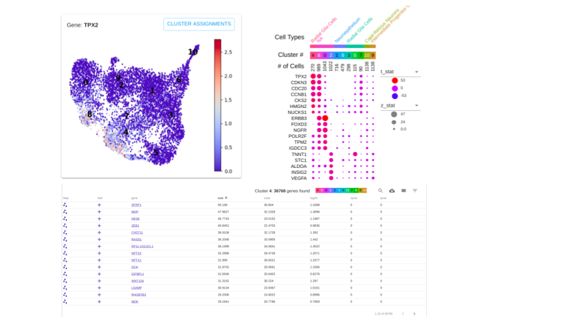

# ctwpy
Generate and Upload Cell Type Worksheets to the UCSC Cell Atlas.

### What is a Cell Type Worksheet?
A Cell Type Worksheet is an application designed to ease the burden of manual cell type 
annotation from single cell
mRNA sequencing experiments. It lets you explore the specificity of markers across clusters 
and label the clusters
with a cell type annotation.

The web application provides three interactive components for this goal:

1. An editable dot plot visualizing marker specificity and cell type annotation across all clusters.
2. A scatter plot visualizing gene expression across all cells.
3. A table of gene metric rankings per cluster.

Here's a rough visual of the layout of the application, the gene metrics are explored via the 
table at the bottom.


This python package manipulates a scanpy object into the ctw format and provides an avenue 
for uploading a worksheet to the UCSC Cell Atlas.

### Install

If you haven't done so already, head over to the 
[Cell Atlas registry](https://cellatlasapi.ucsc.edu/user/register)
and make an account, remember to answer the confirmation email.

You'll need python3.4+, [git](https://gist.github.com/derhuerst/1b15ff4652a867391f03), 
[pip](https://pip.pypa.io/en/stable/installing/), and 
[virtualenv](https://virtualenv.pypa.io/en/latest/installation/) installed on your machine.

Clone the repository and make a virtual environment.
```
git clone https://github.com/Stuartlab-UCSC/ctwpy.git
cd ctwpy
# Create a python3 virtual environment to install the package in.
virtualenv -p $(which python3) env
```
 Once inside your virtual environment use pip3 to install dependencies.
```
# Enter virtual environment
source env/bin/activate
# Use pip to install
pip3 install --editable .
```
Now you'll be able to access the applications command line interface. The command line 
interface is available anytime you enter the environment.
### Command Line Interface
```
# Enter virtual environment
source env/bin/activate

# Check out the help documentation:
ctw-from-scanpy --help
ctw-scanpy-obs --help

# Create a Cell Type Worksheet formatted file from a scanpy object.
ctw-from-scanpy worksheet-name dataset-filename.h5ad
```

To upload this worksheet data to the server, go to http://cellatlas.ucsc.edu/cell-type, 
log in, open the menu in the upper left and select "Upload Data".

If you do not have an account yet, you may create one by clicking on "Sign in" in the upper 
right of the screen. Then click on "Register".
